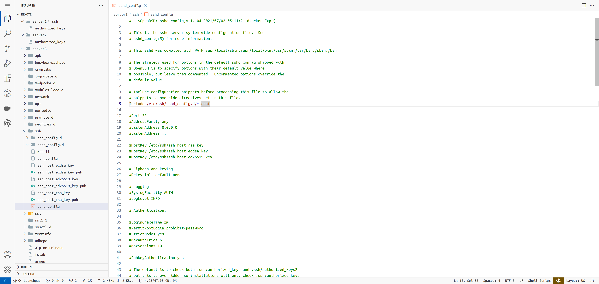
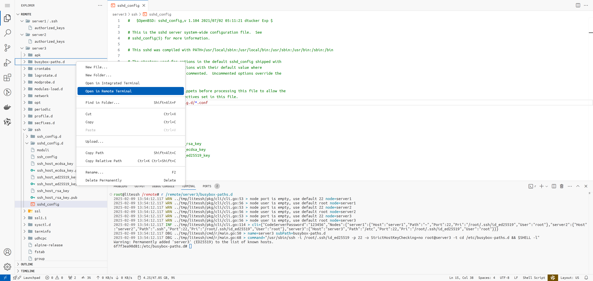

# LiteSSH

> 轻量级的多服务器管理，强大的 VSCode 编辑体验，让远程工作更加高效无缝

LiteSSH 具有以下优点

- 强大的文件编辑体验：基于 VSCode，支持语法高亮、智能提示、快捷键
- 多服务器支持：在多个服务器之间复制、移动文件
- 开源：防止恶意的密钥泄露，允许进一步的自定义
- Web：在浏览器中运行，无需在多台设备上安装客户端
- 配置同步：在后端统一保存服务器配置和密钥，无需在多台设备上重复配置
- 迅速响应：后端与服务器长期维护 SSH 连接，而不是打开客户端后才开始连接
- 插件生态：兼容 VSCode 插件

VSCode Remote 用于管理服务器时非常便利。其布局为左侧文件栏，右边文件内容和终端。得益于文件栏、终端的联动和 VSCode 本身强大的文本编辑功能，VSCode Remote 具有远好于 XSHELL、XFTP、WinSCP、FinalShell 的使用体验。然而，VSCode Remote 具有以下缺点

- 缺乏多服务器支持：只能一个个点开需要连接的服务器，而且无法在服务器之间复制、移动文件
- 不开源：尽管 VSCode 本体是开源的，但是 VSCode Remote 不开源
- 安装 Agent：需要在服务器上安装 Agent，因此产生了各种问题。
    - Agent 安装/更新时下载失败
    - Agent 基于 Node，无法安装在某些特定的发行版上
    - Agent 无法运行在太老的发行版上
    - Agent 安装可能会违反服务器的安全管理规则
- 客户端安装：需要在每个设备上安装、持续更新 VSCode
- 配置难以同步：需要在每个设备上反复配置服务器连接信息、密钥
- 响应慢：连接服务器时，会新建窗口、建立连接，每个服务器都需等待好几秒。网络中断后，需要痛苦地重复以上流程

LiteSSH 在 VSCode 的基础上，避免了对 Agent 的依赖，因此在运维场景下拥有更高的效率。但是，Agent 的缺失使 LiteSSH 插件无法与服务器环境交互，因此复杂的远程开发仍然需要 VSCode Remote。（当然，也可以通过 code-server 实现远程开发）

## 快速开始

准备配置文件和 Docker Compose 声明文件

```sh
git clone https://github.com/117503445/LiteSSH.git
cd LiteSSH/docs/example
```

对于中国大陆用户，可以从阿里云 ACR 拉取 Docker 镜像

```sh
docker pull registry.cn-hangzhou.aliyuncs.com/117503445/litessh && docker tag registry.cn-hangzhou.aliyuncs.com/117503445/litessh 117503445/litessh
```

启动服务

```sh
docker compose up -d
```

在浏览器中打开 <http://localhost:4444/?folder=/remote>，输入密码 123456

即可开始管理 server1、server2 和 server3



在 文件/文件夹 上点击 Open in Remote Terminal，即可打开远程终端



也可以直接在终端输入 `r server3`，即可远程连接到 server3。

## 配置参考

使用 TOML 格式配置文件，以快速开始中的配置为例

```toml
code-server-password = "123456"

[nodes.server1]
host = "server1"
pri = "/root/.ssh/id_ed25519"
# default path is ~
# default user is root
# default port is 22

[nodes.server2]
host = "server2"
pri = "/root/.ssh/id_ed25519"
path = ".ssh" # use relative path of ~

[nodes.server3]
host = "server3"
pri = "/root/.ssh/id_ed25519"
path = "/etc" # use absolute path
```

`code-server-password` 是 code-server 的密码。默认为空。当 `code-server-password` 为空时，code-server 无需密码即可登录。

`nodes` 是一个数组，每个数组元素代表一个服务器。`nodes.server1` 定义了 server1 服务器的配置。

每个服务器支持以下配置

| 配置项 | 默认值 | 是否必须 | 描述 |
| --- | --- | --- | --- |
| host | - | 是 | 服务器的主机名或 IP 地址 |
| port | 22 | 否 | 服务器的 SSH 端口 |
| user | root | 否 | 服务器的用户名 |
| pri | - | 是 | 私钥路径 |
| path | ~ | 否 | 服务器的挂载目录。当 `path` 为空时，默认为 `~`；当 `path` 以 `/` 开头时，表示绝对路径；否则，为 `~` 下的相对路径，如 `.ssh` 表示 `~/.ssh` |

只支持私钥登录，不支持密码登录。

## 实现

了解 LiteSSH 的实现方式，可以帮助你定位解决相关问题。

LiteSSH 镜像基于 ArchLinux，预装了 code-server。此外，还编译打包安装了 LiteSSH 插件，用于添加右键打开远程终端功能。

容器启动时，首先启动 entrypoint。entrypoint 会做这 2 件事
- 启动 code-server，并根据配置文件设置密码
- 启动 litessh 服务，并根据配置文件，使用 Rclone 将每个服务器的指定目录挂载在 `/remote` 下

用户在打开远程终端后，LiteSSH 插件打开新终端，并输入 `r $path`。其中 `$path` 为用户点击的目录路径。`r` 程序接收 `$path` 参数后，结合配置文件，生成并执行 SSH 命令，实现打开远程终端。

容器中的 `/workspace/logs` 包含了 code-server、litessh、每个 Rclone 服务的日志。